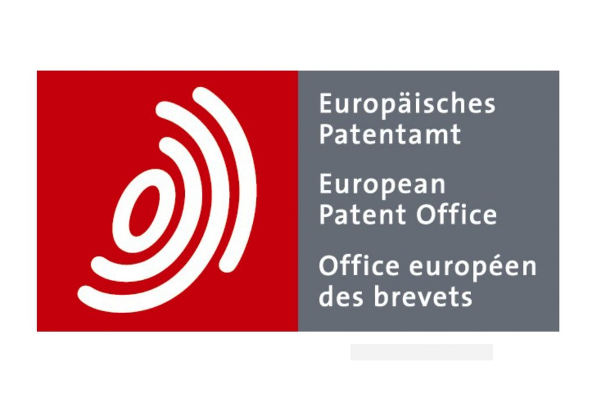
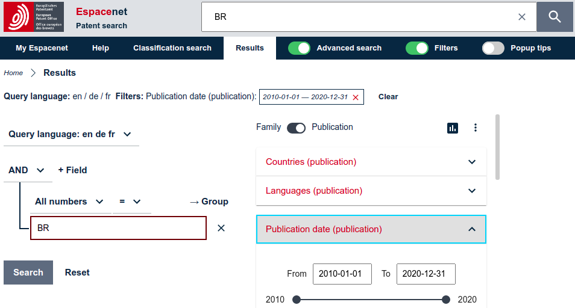
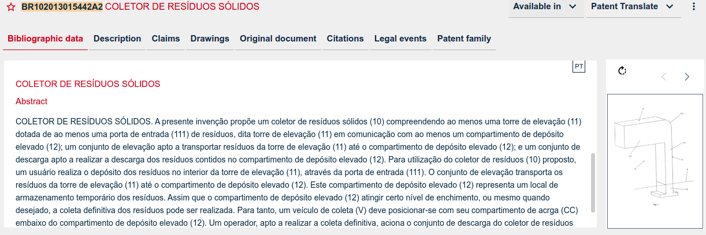
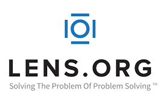
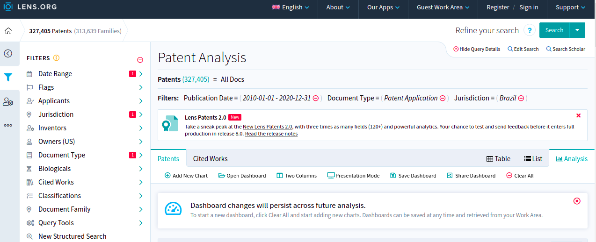
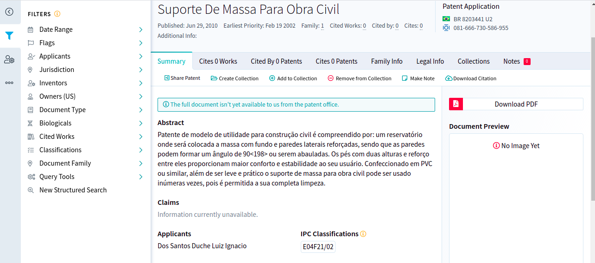
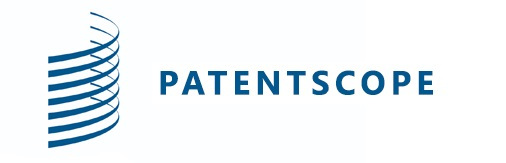
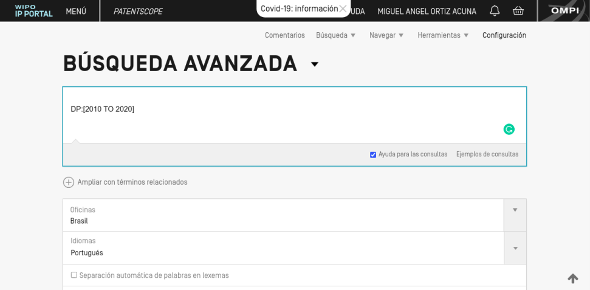
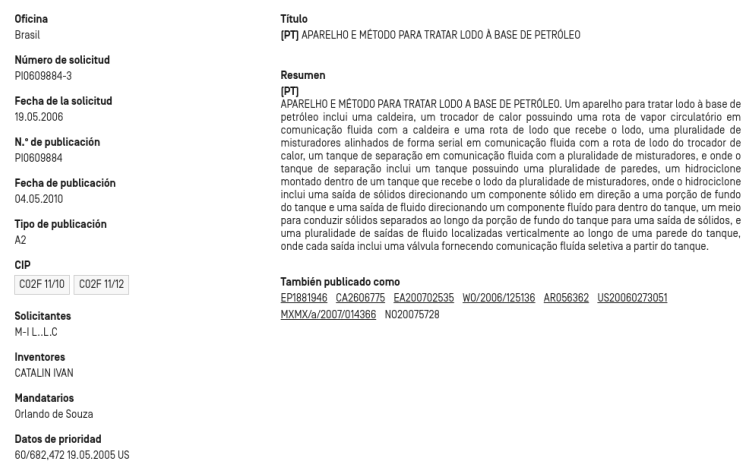

```{r setup, include=FALSE}
knitr::opts_chunk$set(echo = TRUE)
library(tidyverse)
library(lubridate)
library(extrafont)
library(kableExtra)
library(janitor)
loadfonts()
```


***
***

# Patent Platforms


O primeiro analise foi comparar os principais sites que fornecem informação sobre patentes especialmente
nos paises envolvidos em nosso estudo (Brazil, Mexico, Argentina e Colombia). Existem tres sites que são 
muito conhecidos noa ambito de patentes e são os seguintes:


- Espacenet
- The Lens
- Patentscope

## Espacenet

<center>
{width=50%}
</center>

*Espacenet* é um site de graça de busquedas de patentes e foi desenvolvido pela *European Patent Office (EPO)* junto com os estados membros da Organização Europeia de Patentes. Espacenet foi lanzado no ano
1998 e tem se atualizado com sistemas de busquedas com lenguagens de consultas.

<br>

### Sistema de Consultas
<br>
<center>
{width=600%}
</center>

<br>
O sistema de consultas possue filtros para procurar patentes pelo pais, lingua e data de publicação. O sistema 
registra a solicitação de patente e da um seguimento ao processo legal até que a patente seja concedida. Espacenet 
tambem oferece o serviço de baixar uma determinada faixa de patentes en formatos csv, xlsx e pdf; mas tem a desvantagem que só permite baixar 500 informacações de patentes por documento então pode ser muito demorado obter
informação de patentes em intervalos de tempo distantes. Os arquivos baixados de espacenet oferecem informações gerais das patentes (Titulo, inventores, data de publicação, etc) mas não oferece tipos de patentes ouseja o sistema esta focado unicamente em patentes solicitadas. 

### Exemplo de documento de patente

<br>
<center>
{width=80%}
</center>
<br>

A principal virtude de Espacenet é o detalheamento das informações sobre patentes onde oferece resumos tecnicos, documento original em pdf, os processos legais da patente, citações da patente, entre outras. Espacenet é um bom site para obter informações especificas para uma quantidade pequena de patentes mas quando se precisa de muitos dados bibliometricos Espacenet não oferece bons recursos para o analista. 

***


## The Lens


<center>
{width=50%}
</center>


The lens é um site de graça de busquedas de informações de patentes fornecido pelo Cambya, uma organização sem fins lucrativos com sede na Austrália.  Lançado em 2000 como Patent Lens, o site permite buscas gratuitas de mais de 10 milhões de documentos de patentes em texto completo, incluindo patentes dos paises que integram os tratados de cooperação de patentes (PCT). 

<br>

### Sistema de Consultas

<br>
<center>
{width=100%}
</center>
<br>
The Lens oferece um sistema de consultas usando operadores logicos, campos diversos para filtragem (data de publicações, tipos de patentes, citações, etc) e um modulo de analise onde se podem obter analises estatisticos das busquedas realizadas. O site permite baixar documentos de informações de patentes em formatos xlsx, csv, BibTex e Json com a principal ventagem que é possivel baixar documentos de até 50,000 patentes. Os arquivos baixados de The Lens são bem estruturados com informações basicas das patentes (data de publicação, titulo, inventor) com a peculiaridade que tem agrupados a patentes por tipo: Patente solicitada, Patente limitada, Patente concedida, Patente modificada.
<br>

### Exemplo de documento de patente

<br>
<center>
{width=100%}
</center>
<br>

The Lens não tem um bom detalhado dos documentos das patentes, o site esta focado em obter os metadatos das patentes então The Lens é adecuado para fazer analises de intervalos de tempos distantes porque podem ser baixados muitos dados em poco tempo e com os metadatos mais importates das patentes. A desvantagem do The Lens é que não é apropiado em analises especificos de patentes que abrange processo legais ou documentação oficial.  

***

## Patentscope
<br>

<center>
{width=50%}
</center>

<br>

Patentscope é um motor de busca online de patentes, o site é administrado pela Organização Mundial para Propriedade Intelectual (WIPO), a agência especializada das Nações Unidas Estados Unidos que lida com questões de propriedade intelectual (IP). 

<br>

### Sistema de Consultas
<center>
{width=80%}
</center>

<br>

Patentscope oferece um sistema de consultas usando operadores logicos, campos diversos e um abrangente escolha de linguas fornecendo um analise exploratorio simple. O site permite baixar arquivos em formato xlsx podendo obter 1000 patentes por documento mas as informações dos arquivos são limitadas unicamente em data de aplicação da patente e titulo; então não oferece informações dos inventores e aplicantes.

<br>

### Exemplo de documento de patente

<br>

<center>
{width=80%}
</center>

<br>

Patentscope é muito completo para oferecer dados especificos de um documento de patente mas essas informações
não são exportadas nos documentos xlsx pelo qual não é uma ferramenta interessante para analise de metadatos de
patentes. 

***

## Comparação entre sites

<br>

Para saber se os três sites possuem as mesmas patentes se fez uma comparação entre sites tomando em consideração o Brasil com um periodo de 10 anos (2010-2020):

<br>

```{r grafico_patente_anuales , echo= FALSE, fig.align='center', message=FALSE}
sites_patentes <- read_csv("Dataset/numero_patentes_ano.csv")

sites_patentes %>%
  mutate(ano = years(ano), ano = year(ano), site= as.factor(site)) -> sites_patentes

ggplot(data = sites_patentes)+
  geom_point(mapping = aes(x = ano, y = numero_patente, color = site))+
  geom_line(mapping = aes(x = ano, y = numero_patente, color = site))+
  theme_bw()+
  labs(caption = "Figura 1: Grafico de linha das patentes por site periodo (2010-2020)",
       y= "Numero de patentes")+
  scale_x_continuous(breaks = seq(2010,2020,1))+
  theme(axis.title.x = element_blank(),
        axis.title.y = element_text(family = "Times New Roman"),
        plot.title = element_text(family = "Times New Roman", hjust = 0.5, size = 18),
        plot.subtitle = element_text(family = "Times New Roman", hjust = 0.5, size = 15),
        plot.caption = element_text(hjust = 0.5,family = "Times New Roman", size = 10),
        legend.title.align = 0.5,
        legend.text = element_text(family = "Times New Roman"))+
  scale_y_continuous(breaks = seq(10000,75000,5000))+
  guides(color=guide_legend(title=""))
  
```
<br>

Como podemos observar na grafica 1 as patentes entre sites tem uma diferença não muito significativa, tambem se analisou o mes de janeiro de 2021 entre sites e os resultados mostram um porcentagem de acerto de um 90% entre cada site, pelo tanto qualquer dos três sites são validos. O seguinte passo seria já em termos tecnicos ou seja qual site seria mais adequado para nosso analise.  

A seguinte tabela mostra as caracteristicas de cada site que ajudara a tomar uma decisão sobre qual site usar em nossa proxima reunião:

```{r tabela_patentes_anuales, echo=FALSE, message=FALSE}
tabela_sites <- read.csv("Dataset/resumo_sites.csv") 

kbl(tabela_sites) %>% 
  kable_styling(bootstrap_options = c("striped", "hover"))

#knitr::kable(tabela_sites, align = "lccrr")
#tabela_sites %>% 
#  kableExtra::kbl(caption = "Prova") %>%
#  kable_classic(full_width = F, html_font = "Cambria")
  
  
```

***
***

# Dados para relativizar

## Renda per capita

Os seguintes dados da renda per capita (USD a preços atuais) são fornecidos pelo Banco Mundial: 

```{r renda_per_capita, echo=FALSE, message=FALSE, fig.align='center'}

renda <- read.csv("Dataset/Renda_per_capita.csv")
renda %>% 
  clean_names() %>% 
  filter(country_name %in% c("Brasil", "Chile", "Argentina", "México")) %>%
  select(country_name, x2010:x2019) %>%  
  rename_all(~str_replace_all(.,"x","")) %>%  
  gather(`2010`:`2019`, key = ano, value = renda) %>% 
  mutate(country_name = as.factor(country_name),
         ano = years(ano),
         ano = year(ano)) -> renda

```

```{r plot_renda, echo=FALSE, message=FALSE, message=FALSE, fig.align='center'}
ggplot(data = renda)+
  geom_point(mapping = aes(x = ano, y = renda))+
  geom_line(mapping = aes(x = ano, y = renda))+
  theme_bw()+
  labs(caption = "Figura 2: Grafico de linha das rendas per capita do Mexico, Brasil, Chile e Argentina (2010-2019)",
       y= "Renda per capita (USD)")+
  scale_x_continuous(breaks = seq(2010,2019,1))+
  theme(axis.title.x = element_blank(),
        axis.title.y = element_text(family = "Times New Roman"),
        plot.title = element_text(family = "Times New Roman", hjust = 0.5, size = 18),
        plot.subtitle = element_text(family = "Times New Roman", hjust = 0.5, size = 15),
        plot.caption = element_text(hjust = 0.5,family = "Times New Roman", size = 10),
        legend.title.align = 0.5,
        legend.text = element_text(family = "Times New Roman"))+
  scale_y_continuous(breaks = seq(8000,16000,1000))+
  guides(color=guide_legend(title=""))+
  facet_wrap(~country_name)
  
```


```{css, echo=FALSE}
body{
  font-family: "Times New Roman";
  font-size: 16pt;
  text-align: justify;
}
/* Headers */
h1{
  font-size: 18pt;
  font-family: "Lora";
  font-weight: bold;
}

/* Headers */
h2{
  font-size: 16pt;
  font-family: "Lora";
  font-weight: bold;
}


/* Headers */
h3{
  font-size: 16pt;
  font-family: "Lora";
  font-weight: bold;
}

div.centrado{
  text-align: center;
}